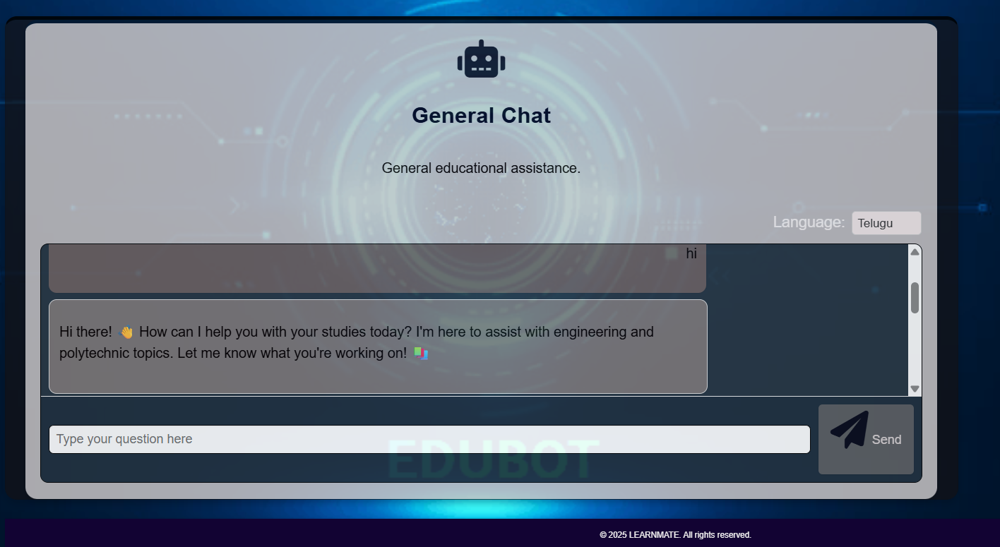
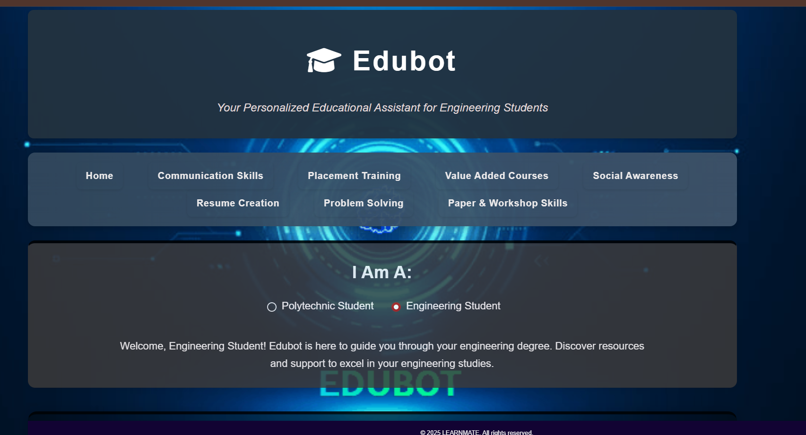
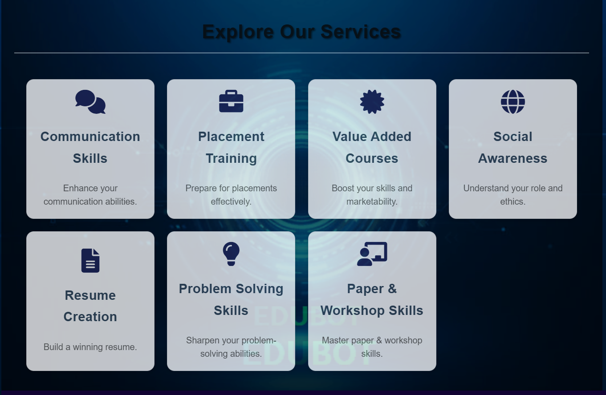
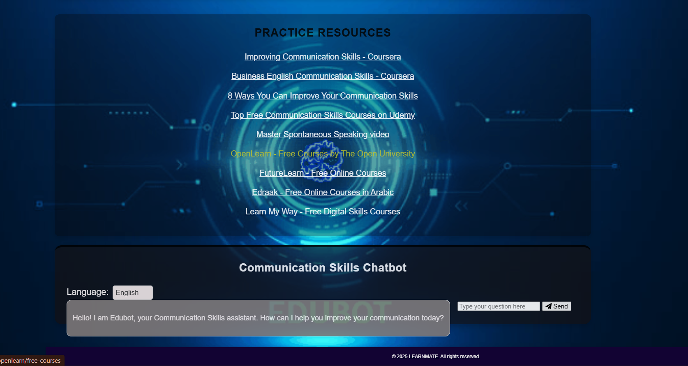

# EduBot - Your Educational AI Assistant

EduBot is a versatile, AI-powered educational chatbot designed to support engineering and polytechnic students in their academic and professional development. Built with Google's Generative AI (Gemini), EduBot provides specialized guidance, multi-language support, and extensible features, including placeholder image analysis capabilities for enhanced learning.

## Features

- **Multi-language Support**: Engage with EduBot in English, Tamil, Hindi, Malayalam, and Telugu for a personalized experience.
- **Specialized Chatbot Services**:
  - **Communication Skills**: Improve verbal, written, and interpersonal communication with tailored guidance.
  - **Placement Training**: Prepare for interviews, aptitude tests, and group discussions to secure your dream job.
  - **Value-Added Courses**: Explore technical and soft-skill courses to complement your curriculum.
  - **Social Awareness**: Gain insights into environmental sustainability, ethical practices, and societal impact.
  - **Resume Creation**: Craft professional resumes and career documents with expert assistance.
  - **Problem Solving**: Enhance critical thinking with targeted exercises and strategies.
  - **Paper Presentation & Workshops**: Excel in academic presentations and workshops with structured guidance.

## Technologies Used

- **Flask**: Lightweight Python web framework for building the backend.
- **Google Generative AI (Gemini)**: Powers natural language understanding and intelligent responses.
- **Flask-CORS**: Enables seamless Cross-Origin Resource Sharing for frontend-backend integration.
- **Markdown2**: Converts bot responses into HTML for rich text rendering.
- **Werkzeug**: Ensures secure file uploads for image analysis features.
- **Requests**: Manages HTTP requests with robust error handling.

## Prerequisites

- Python 3.8 or higher
- Git
- A Google Gemini API key from Google AI Studio
- Basic familiarity with Flask and web development

## Setup and Installation

Follow these steps to set up EduBot locally:

1. **Clone the Repository**:

   ```bash
   git clone https://github.com/your-username/Edubot-main.git
   cd Edubot-main
   ```

2. **Create and Activate a Virtual Environment**:

   ```bash
   python -m venv venv
   # On Windows
   .\venv\Scripts\activate
   # On macOS/Linux
   source venv/bin/activate
   ```

3. **Install Dependencies**:

   ```bash
   pip install -r requirements.txt
   ```

4. **Configure the Application**:

   - **Google Gemini API Key**: Obtain an API key from Google AI Studio and update line 16 in `app.py` with your key:

     ```python
     genai.configure(api_key="your-api-key-here")
     ```

5. **Set Up Knowledge Base (Optional)**:

   - EduBot uses `.txt` files in `knowledge_base/<language>` (e.g., `knowledge_base/en/communication.txt`) to enhance responses.
   - Create or modify these files to customize chatbot responses for specific services and languages.

## Running the Application

1. **Start the Flask Server**:

   ```bash
   python app.py
   ```

2. **Access EduBot**:

   - Open a web browser and navigate to `http://127.0.0.1:5000/`.
   - Explore the general chatbot or visit specific service pages (e.g., `/communication`, `/placement`, etc.).

3. **Interact with Features**:

   - Use the general chatbot for broad queries or access specialized bots for targeted guidance.

## Screenshots

### General Chat Interface

\
*Description*: The General Chat interface allows users to interact with EduBot for general educational assistance in multiple languages, such as Telugu.

### Homepage

\
*Description*: The homepage provides an overview of EduBot's services and allows users to select their student type (Polytechnic or Engineering).

### Service Exploration

\
*Description*: This section highlights the various services offered, including Communication Skills, Placement Training, and more.

### Communication Skills Chatbot

\
*Description*: The Communication Skills Chatbot offers resources and interactive assistance to improve communication abilities.

*Note*: Place the screenshot images in a `screenshots/` directory within the project root and name them as `general_chat.png`, `homepage.png`, `service_exploration.png`, and `communication_skills.png` respectively.

## Access the Live Website

Explore EduBot in action: https://edubot-kr5a.onrender.com/

## Project Structure

```
Edubot-main/
├── app.py                    # Main Flask application
├── requirements.txt          # Project dependencies
├── templates/                # HTML templates
│   ├── index.html            # Homepage
│   └── services/             # Service-specific templates
│       ├── communication.html
│       ├── placement.html
│       ├── value_added.html
│       ├── social_awareness.html
│       ├── resume.html
│       ├── problem_solving.html
│       └── paper_workshop.html
├── screenshots/              # Directory for screenshot images
│   ├── general_chat.png
│   ├── homepage.png
│   ├── service_exploration.png
│   └── communication_skills.png
```

## Contributing

We welcome contributions to enhance EduBot! To contribute:

1. Fork the repository.
2. Create a new branch for your feature or bug fix:

   ```bash
   git checkout -b feature/your-feature-name
   ```
3. Make changes and adhere to the project's coding style (PEP 8 for Python).
4. Write and run tests to validate your changes.
5. Submit a pull request with a clear description of your changes.

## Troubleshooting

- **API Key Errors**: Ensure the Google Gemini API key is correctly configured in `app.py`.
- **Dependency Issues**: Run `pip install -r requirements.txt` again to ensure all dependencies are installed.

## Contact

For questions or feedback, please open an issue on the GitHub repository or contact the project maintainers.

## License

This project is licensed under the MIT License.
